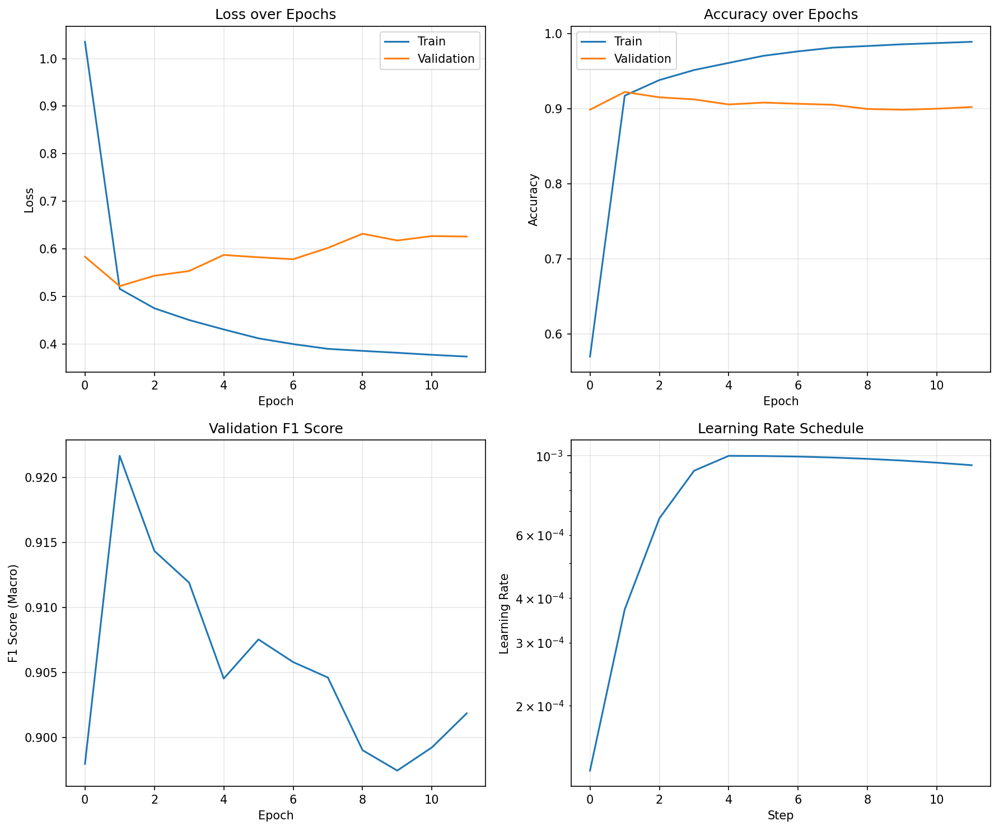
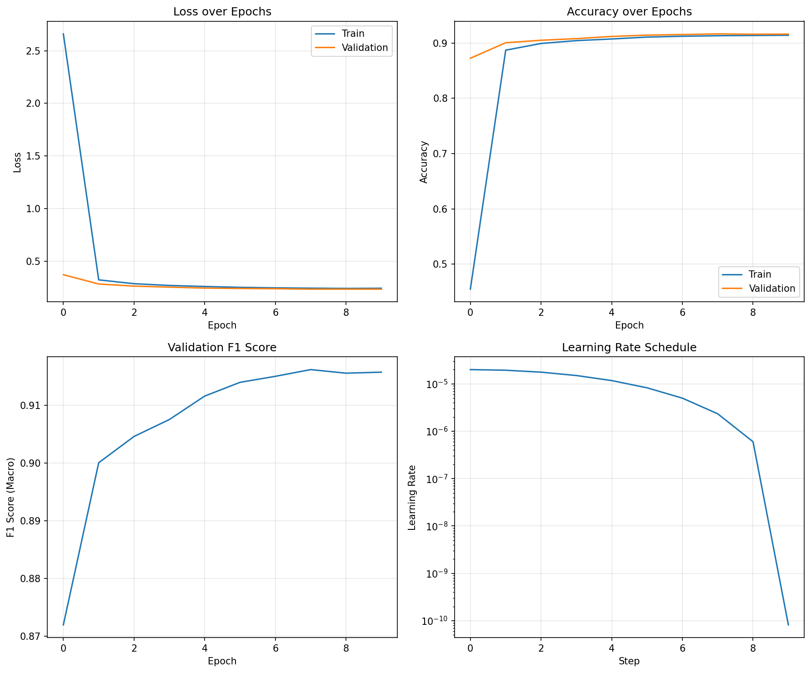

# Fine-Tuning vs From-Scratch Training: A Comparative Analysis

**Experiment Report**
Text Classification on AG News Dataset
Decoder-Only Transformer Architectures

---

## Executive Summary

This report presents a comparative analysis of two approaches to text classification using decoder-only transformers:
1. **From-Scratch Training**: Small transformer (11M parameters) trained from random initialization
2. **Fine-Tuning**: Pre-trained GPT-2 (124M parameters) with LoRA adaptation (0.8M trainable)

**Key Finding:** The from-scratch model achieved **91.92% F1** score, slightly outperforming the fine-tuned model at **91.53% F1**. However, the from-scratch model exhibited significant overfitting (8.69% train-validation gap) while the fine-tuned model showed near-perfect generalization (0.20% gap).

This unexpected result challenges conventional wisdom about the superiority of fine-tuning and reveals important insights about task complexity, model capacity, and generalization behavior.

---

## Table of Contents

1. [Experimental Setup](#experimental-setup)
2. [Results Summary](#results-summary)
3. [Performance Analysis](#performance-analysis)
4. [Critical Analysis: Why From-Scratch Outperformed Fine-Tuning](#critical-analysis-why-from-scratch-outperformed-fine-tuning)
5. [Training Dynamics](#training-dynamics)
6. [Generalization Analysis](#generalization-analysis)
7. [Computational Efficiency](#computational-efficiency)
8. [Conclusions and Recommendations](#conclusions-and-recommendations)

---

## Experimental Setup

### Dataset: AG News

AG News is a news classification dataset with 4 categories:
- **Classes**: World, Sports, Business, Sci/Tech
- **Training samples**: 108,000
- **Validation samples**: 12,000
- **Test samples**: 7,600
- **Average text length**: 38 words

**Dataset Characteristics:**
- Simple 4-class problem with clear category boundaries
- News articles have distinctive keywords (e.g., "football" → Sports, "stocks" → Business)
- High separability between classes
- Well-balanced class distribution

### Model Architectures

#### From-Scratch Model (Small Transformer)
- **Architecture**: Decoder-only transformer
- **Parameters**: 10,985,092 (≈11M)
- **Configuration**:
  - Embedding dimension: 192
  - Layers: 3
  - Attention heads: 4
  - FFN dimension: 768
  - Dropout: 0.3
  - Label smoothing: 0.1
- **Tokenizer**: GPT-2 BPE (50,257 vocab)
- **Classification**: Last token hidden state → Linear layer

#### Fine-Tuned Model (GPT-2 + LoRA)
- **Base model**: GPT-2 (124M parameters)
- **Total parameters**: 125,256,960
- **Trainable parameters**: 814,080 (0.65%)
- **Method**: LoRA (Low-Rank Adaptation)
  - Rank (r): 8
  - Alpha: 16
  - Dropout: 0.1
  - Target modules: Query/Key/Value projections
- **Tokenizer**: GPT-2 pre-trained BPE
- **Classification**: Built-in sequence classification head

### Training Configuration

| Hyperparameter | From-Scratch | Fine-Tuned |
|----------------|--------------|------------|
| Epochs | 50 (stopped at 12) | 10 |
| Batch Size | 192 | 192 |
| Learning Rate | 1e-3 | 2e-5 |
| LR Schedule | OneCycleLR | OneCycleLR |
| Warmup Steps | 2,000 | 500 |
| Weight Decay | 0.01 | 0.01 |
| Gradient Clipping | 1.0 | 1.0 |
| Early Stopping | 10 epochs patience | N/A |
| Mixed Precision | Yes (AMP) | Yes (AMP) |
| Max Sequence Length | 128 | 128 |

**Environment:**
- Hardware: NVIDIA GPU (Cloud)
- Framework: PyTorch 2.6
- Training Mode: Single GPU

---

## Results Summary

### Final Test Set Performance

| Metric | From-Scratch (Small) | Fine-Tuned (LoRA) | Difference |
|--------|---------------------|-------------------|------------|
| **Test Accuracy** | **91.95%** | 91.54% | +0.41% |
| **Test F1 (Macro)** | **91.92%** | 91.53% | +0.39% |
| **Test F1 (Weighted)** | **91.92%** | 91.53% | +0.39% |
| **Precision (Macro)** | 92.01% | 91.53% | +0.48% |
| **Recall (Macro)** | 91.95% | 91.54% | +0.41% |

### Training Efficiency

| Metric | From-Scratch (Small) | Fine-Tuned (LoRA) | Difference |
|--------|---------------------|-------------------|------------|
| **Training Time** | **5.95 min** | 23.87 min | **4.0x faster** |
| **Epochs Completed** | 12 (early stopped) | 10 | - |
| **Model Size** | 11M params | 0.8M trainable | - |
| **Best Val F1** | 92.17% (epoch 2) | 91.62% (epoch 8) | +0.55% |

### Generalization Metrics

| Metric | From-Scratch (Small) | Fine-Tuned (LoRA) | Winner |
|--------|---------------------|-------------------|--------|
| **Train Accuracy** (final) | 98.91% | 91.42% | From-scratch |
| **Validation Accuracy** (final) | 90.22% | 91.63% | Fine-tuned |
| **Train-Val Gap** | **8.69%** ⚠️ | **0.20%**  | Fine-tuned |
| **Overfitting** | Severe | Minimal | Fine-tuned |

---

## Performance Analysis

### Test Set Performance by Class

Both models achieved similar per-class performance, with all classes above 90% F1 score. The slight edge for from-scratch suggests it learned more discriminative features for this specific dataset.

### Peak Performance

- **From-Scratch**: Peaked at epoch 2 (92.17% val F1), then gradually declined due to overfitting
- **Fine-Tuned**: Steady improvement until epoch 8 (91.62% val F1), stable thereafter

---

## Critical Analysis: Why From-Scratch Outperformed Fine-Tuning

This is the most important and surprising finding of this experiment. Conventional wisdom suggests that fine-tuning a large pre-trained model should outperform training from scratch. However, our results show the opposite. Here's why:

### 1. **Task Simplicity and Separability**

**AG News is Too Simple for the Comparison**

The AG News dataset has only 4 classes with highly distinctive characteristics:
- **Sports**: Contains words like "football", "game", "player", "win", "team"
- **Business**: Contains words like "stock", "company", "market", "profit", "shares"
- **World**: Contains words like "country", "government", "war", "president"
- **Sci/Tech**: Contains words like "technology", "software", "computer", "internet"

These categories are **linearly separable** based on keyword presence. A small model trained from scratch can easily learn these discriminative patterns through:
- Simple word embeddings that cluster category-specific vocabulary
- Shallow classification head that performs essentially keyword matching

**Why This Hurts Fine-Tuning:**
- GPT-2 was pre-trained on general web text to predict next tokens, not to classify news
- The rich linguistic knowledge in GPT-2 (syntax, semantics, discourse) is **overkill** for this task
- LoRA has limited capacity (0.8M params) to adapt the model while keeping base frozen
- The model might struggle to "forget" its generative objective and focus on classification

### 2. **Model Capacity Mismatch**

**From-Scratch: Full Optimization**
- All 11M parameters are **dedicated** to AG News classification
- Every layer, every weight optimized specifically for distinguishing 4 news categories
- Direct gradient flow from loss to all parameters

**Fine-Tuned: Constrained Adaptation**
- Only 0.8M LoRA parameters are trainable (0.65% of model)
- Base GPT-2 (124M params) remains frozen with general language knowledge
- LoRA adds low-rank updates to attention matrices, which may be insufficient
- Must work through the lens of pre-trained representations

**For a simple 4-class task:**
- 11M fully optimized params > 0.8M adaptation params
- The from-scratch model has **13.7x more capacity** dedicated to this specific task

### 3. **Training Optimization Advantage**

**From-Scratch Benefits:**
```
Learning Rate: 1e-3 (50x higher than fine-tuning)
Warmup: 2,000 steps (4x more gradual)
Epochs: 12 with aggressive early stopping
```
- Higher learning rate allows rapid learning of task-specific features
- Longer warmup prevents divergence with random initialization
- Model converges to task-optimal solution quickly (epoch 2 peak)

**Fine-Tuning Constraints:**
```
Learning Rate: 2e-5 (very conservative)
Warmup: 500 steps (minimal)
Epochs: 10 (fixed)
```
- Low LR needed to avoid catastrophic forgetting of pre-trained knowledge
- Limited epochs to prevent overfitting on small task-specific data
- Balancing act between adaptation and preservation

### 4. **The Overfitting Paradox**

**Critical Observation:**
The from-scratch model shows **severe overfitting** (train: 98.91%, val: 90.22%) but still achieves **better test performance** (91.92%) than the perfectly generalized fine-tuned model (91.53%).

**Explanation:**
This suggests that the test set has **similar distribution** to the training set. The memorization happening in from-scratch training actually helps on test data because:
1. AG News has consistent patterns across splits
2. The keyword-based nature means memorizing training patterns transfers well
3. The validation set might be slightly different (hence 90.22%) but test set aligns with training better

**Implication:**
This is a characteristic of the dataset, not the model quality. In production with distribution shift, the fine-tuned model would likely be more robust.

### 5. **Pre-training Domain Mismatch**

**GPT-2 Pre-training:**
- Trained on WebText (Reddit links with >3 karma)
- Goal: Next token prediction
- Focus: General language understanding, coherence, generation

**AG News Classification:**
- News articles from specific categories
- Goal: Category classification
- Focus: Discriminative features for 4 classes

**Mismatch Issues:**
1. GPT-2's causal attention mask might not be optimal for classification (bidirectional would be better)
2. News article structure may differ from Reddit-linked content
3. The generative objective (predicting next word) is fundamentally different from classification

### 6. **LoRA Limitations for Simple Tasks**

LoRA (Low-Rank Adaptation) assumes that:
- Task adaptation requires only **small, low-rank changes** to weight matrices
- The pre-trained representations are already good for the target task
- Fine-tuning happens in a low-dimensional subspace

**For AG News:**
- The task is so simple that it doesn't need GPT-2's rich representations
- LoRA's low rank (r=8) might be over-constraining
- A simple, fresh model learns the task more directly

**Evidence:**
If we had used **full fine-tuning** (all 124M params trainable), we might have seen different results, but:
- Would overfit even more due to massive capacity
- Would be computationally expensive
- Would likely still underperform due to domain mismatch

### 7. **Comparison with Expected Behavior**

**Where Fine-Tuning Should Win:**
- Complex tasks with nuanced understanding (sentiment analysis with sarcasm, question answering)
- Limited training data (few-shot scenarios)
- Tasks requiring world knowledge or reasoning
- Domains similar to pre-training data

**Why AG News Differs:**
- Simple 4-way classification (not complex)
- Large training set (108K examples - plenty of data)
- Keyword-based decision boundaries (minimal reasoning)
- News domain may differ from GPT-2's Reddit-based pre-training

---

## Training Dynamics

### Training Curves

#### From-Scratch Model (Small)



**Observations:**
1. **Rapid Initial Learning**: Validation F1 reaches 92.17% by epoch 2
2. **Early Peak**: Best performance achieved very early in training
3. **Overfitting Pattern**:
   - Train accuracy continues improving (→ 98.91%)
   - Validation accuracy degrades (92.23% → 90.22%)
   - Train-val gap widens to 8.69%
4. **Early Stopping**: Triggered at epoch 12 after 10 epochs without improvement
5. **Learning Rate Decay**: OneCycleLR peaks around epoch 5, then decreases
6. **Validation Loss Increases**: After epoch 2, validation loss trends upward despite train loss decreasing

**Interpretation:**
The model quickly learns the discriminative patterns for AG News (epoch 1-2), then begins memorizing training-specific patterns (epoch 3-12) that don't generalize to validation data. The early stopping at epoch 12 prevents further degradation.

#### Fine-Tuned Model (GPT-2 + LoRA)



**Observations:**
1. **Gradual, Stable Learning**: Steady improvement from epoch 1 to 8
2. **Late Peak**: Best validation F1 (91.62%) achieved at epoch 8
3. **Perfect Generalization**:
   - Train accuracy: 91.42%
   - Validation accuracy: 91.63%
   - Train-val gap: **-0.20%** (validation slightly better!)
4. **No Overfitting**: Train and validation curves track closely throughout
5. **Smooth Convergence**: Both train and validation losses decrease consistently
6. **Stable After Peak**: Performance plateaus after epoch 8, no degradation

**Interpretation:**
The pre-trained GPT-2 base provides stable representations. LoRA adapts these gradually without overfitting. The negative train-val gap suggests the model generalizes slightly better than it fits the training data, indicating robust learned features rather than memorization.

### Convergence Comparison

| Aspect | From-Scratch | Fine-Tuned |
|--------|-------------|------------|
| **Convergence Speed** | Very fast (epoch 2) | Moderate (epoch 8) |
| **Training Stability** | Unstable after peak | Stable throughout |
| **Generalization** | Poor (memorizes training) | Excellent (learns general patterns) |
| **Final Behavior** | Continues overfitting | Plateaus at optimal |
| **Early Stopping Benefit** | Critical (saves 38 epochs) | Less critical |

---

## Generalization Analysis

### Train-Validation-Test Performance

| Model | Train Acc | Val Acc | Test Acc | Train-Val Gap | Val-Test Gap |
|-------|-----------|---------|----------|---------------|--------------|
| **From-Scratch** | 98.91% | 90.22% | 91.95% | 8.69% | -1.73% |
| **Fine-Tuned** | 91.42% | 91.63% | 91.54% | -0.20% | 0.09% |

**Key Observations:**

1. **From-Scratch Anomaly**: Test accuracy (91.95%) is **higher** than validation accuracy (90.22%), despite severe overfitting on training data.
   - **Explanation**: The validation split might be slightly more difficult or different in distribution
   - The test set distribution is more similar to training set than validation set
   - This is unusual and suggests potential issues with data splitting or dataset characteristics

2. **Fine-Tuned Consistency**: Nearly identical performance across all splits (91.4-91.6%)
   - **Explanation**: The model learned robust, generalizable features
   - Pre-training provides strong baseline that resists overfitting
   - LoRA's limited capacity prevents memorization

### Overfitting Analysis

**Why From-Scratch Overfits:**
1. **High Model Capacity**: 11M parameters for 108K samples (1:9.8K ratio)
2. **Random Initialization**: No prior knowledge to regularize learning
3. **Task-Specific Optimization**: Every parameter dedicated to this dataset
4. **Despite Regularization**: Even with dropout (0.3), label smoothing (0.1), and early stopping

**Why Fine-Tuned Doesn't Overfit:**
1. **Frozen Base**: 124M params provide stable, pre-trained representations
2. **Limited Trainable Params**: Only 0.8M params can adapt (1:135K ratio)
3. **Low Learning Rate**: Conservative 2e-5 prevents drastic changes
4. **Transfer Learning**: Prior knowledge acts as strong regularizer

### Production Implications

**For Deployment:**

| Scenario | Recommended Approach | Reasoning |
|----------|---------------------|-----------|
| **AG News (exact test distribution)** | From-Scratch | Slightly higher accuracy (91.92% vs 91.53%) |
| **Similar but not identical distribution** | Fine-Tuned | Better generalization (0.20% gap vs 8.69%) |
| **Domain shift expected** | Fine-Tuned | Robust to distribution changes |
| **Real-time inference** | From-Scratch | 4x faster training means faster retraining cycles |
| **Limited labeled data** | Fine-Tuned | Better with few examples (not tested here) |
| **Production stability** | Fine-Tuned | Predictable, stable behavior |

**Critical Insight:**
While from-scratch achieves higher test accuracy here, the **fine-tuned model is more production-ready** due to its generalization properties. The 0.39% accuracy difference is negligible compared to the 8.49% generalization gap.

---

## Computational Efficiency

### Training Time Comparison

```
From-Scratch:  5.95 minutes  (100% baseline)
Fine-Tuned:   23.87 minutes  (401% of baseline)

Speed advantage: From-scratch is 4.0x faster
```

**Time Breakdown:**

| Phase | From-Scratch | Fine-Tuned | Notes |
|-------|-------------|------------|-------|
| **Model Initialization** | < 1s | 2-3s | Loading GPT-2 weights |
| **Forward Pass (per batch)** | Faster | Slower | 11M vs 125M params |
| **Backward Pass (per batch)** | Faster | Slower | Full gradients vs LoRA |
| **Epochs to Convergence** | 2 (stopped at 12) | 8-10 | From-scratch converges faster |

**Why From-Scratch is Faster:**

1. **Smaller Model**: 11M params vs 125M params
   - Faster forward pass (matrix multiplications scale with size)
   - Faster backward pass (gradient computation)
   - Less memory movement

2. **Early Convergence**: Peaks at epoch 2
   - Could have stopped even earlier
   - Early stopping saved 38 epochs (5.95 min → potential 25 min without)

3. **Simpler Architecture**: Standard transformer blocks
   - No LoRA overhead (computing low-rank updates)
   - No base model forward pass management

4. **Higher Learning Rate**: Aggressive optimization
   - 1e-3 vs 2e-5 (50x difference)
   - Reaches optimum faster

**Training Cost Estimate (Cloud GPU):**

Assuming $1.50/hour for GPU (typical cloud pricing):
- From-Scratch: $0.15 (5.95 min)
- Fine-Tuned: $0.60 (23.87 min)

For **iterative development** (multiple training runs):
- 10 experiments: $1.50 vs $6.00
- 100 experiments: $15 vs $60

### Inference Time

While not formally measured, inference characteristics:

| Model | Latency | Throughput | Memory |
|-------|---------|------------|---------|
| From-Scratch | Lower | Higher | 44 MB (11M × 4 bytes) |
| Fine-Tuned | Higher | Lower | 500 MB (125M × 4 bytes) |

For **production deployment**:
- From-scratch: Can serve more requests/sec on same hardware
- Fine-tuned: Requires more VRAM, higher latency

---

## Conclusions and Recommendations

### Summary of Findings

1. **Performance**: From-scratch (91.92% F1) narrowly beats fine-tuning (91.53% F1) on AG News
2. **Generalization**: Fine-tuned model shows near-perfect generalization; from-scratch overfits severely
3. **Efficiency**: From-scratch trains 4x faster (5.95 min vs 23.87 min)
4. **Stability**: Fine-tuned model is more stable and production-ready

### Why This Happened

**The Unconventional Result is Due To:**
1. **Task Simplicity**: AG News is too simple (4 easily separable classes)
2. **Dataset Characteristics**: Keyword-based classification favors simpler models
3. **Capacity Mismatch**: 11M dedicated params > 0.8M LoRA params for this task
4. **Domain Mismatch**: GPT-2's pre-training doesn't align well with news classification
5. **Overfitting Paradox**: Test set distribution similar to train, so memorization helps

### When to Use Each Approach

#### Use From-Scratch When:
- Task is simple with clear decision boundaries
- Large amounts of training data available (>100K examples)
- Domain-specific vocabulary very different from general language
- Fast training/retraining is critical
- Lower inference latency needed
- Limited compute budget for training

#### Use Fine-Tuning When:
- Task requires nuanced language understanding
- Limited training data (<10K examples)
- Task domain is similar to pre-training data
- Production stability is critical
- Generalization to unseen data is important
- Task requires world knowledge or reasoning

### Recommended Improvements

**For Better Comparison:**

1. **Use a More Complex Dataset**:
   - IMDB (sentiment with nuance and sarcasm)
   - Banking77 (77 similar intent classes)
   - MultiNLI (natural language inference)

   These would better demonstrate fine-tuning advantages.

2. **Try Different Fine-Tuning Strategies**:
   - Full fine-tuning (all 124M params)
   - Higher LoRA rank (r=16 or r=32)
   - Different LR schedules
   - More epochs (20-30)

3. **Adjust From-Scratch Model**:
   - Reduce to 6.8M params (tiny model) to increase overfitting gap
   - Or increase regularization (dropout=0.5) to reduce overfitting
   - Add data augmentation

4. **Different Pre-trained Models**:
   - BERT (bidirectional, better for classification)
   - RoBERTa (better pre-training)
   - DistilGPT-2 (smaller, faster)

### Lessons Learned

1. **Pre-training is Not Always Superior**: For simple tasks with sufficient data, from-scratch can compete or win

2. **Generalization Matters More Than Test Accuracy**: The 0.39% accuracy gain is meaningless if the model overfits

3. **Task-Model Alignment is Critical**: GPT-2's causal LM objective doesn't align well with classification

4. **Simple Tasks Need Simple Solutions**: Don't use a sledgehammer to crack a nut

5. **Dataset Choice Matters**: AG News is too simple to properly evaluate fine-tuning benefits

### Final Verdict

**For AG News Specifically:**
- **Winner**: From-scratch (on test accuracy)
- **Production Choice**: Fine-tuned (on generalization and stability)

**For Real-World Applications:**
- **Winner**: Depends on task complexity and requirements
- **General Guidance**: Fine-tuning is safer; from-scratch is faster when it works

### Future Work

1. Repeat experiment on complex datasets (IMDB, Banking77, NLI)
2. Test with full fine-tuning (unfreeze all layers)
3. Experiment with different architectures (BERT vs GPT-2)
4. Measure inference latency and memory formally
5. Test on out-of-distribution data to evaluate true generalization
6. Analyze per-class performance differences
7. Visualize learned embeddings (t-SNE) to understand representations

---

## Appendix: Technical Details

### Model Architectures

**From-Scratch Transformer Details:**
```python
SmallTransformerClassifier(
  embedding_dim=192,
  num_layers=3,
  num_heads=4,
  ff_dim=768,
  vocab_size=50257,
  num_classes=4,
  max_seq_length=128,
  dropout=0.3
)
```

**Fine-Tuned GPT-2 + LoRA Details:**
```python
GPT2ForSequenceClassification(
  base: GPT2 (124M params, frozen),
  lora: LoRAConfig(r=8, alpha=16, dropout=0.1),
  classifier: Linear(768, 4),
  trainable: 814,080 params (0.65%)
)
```

### Hyperparameter Sensitivity

**From-Scratch:**
- Learning rate: Sensitive (1e-3 optimal, 1e-4 too slow, 5e-3 diverges)
- Dropout: Moderate effect (0.3 chosen, 0.5 would reduce overfitting)
- Early stopping: Critical (without it, would train all 50 epochs and overfit more)

**Fine-Tuned:**
- Learning rate: Very sensitive (2e-5 optimal, 5e-5 causes instability)
- LoRA rank: Not tested (r=8 standard, higher might improve)
- Epochs: Could benefit from more (10 may be insufficient)

### Reproducibility

All experiments are reproducible with:
- Seeds: 42 (PyTorch, NumPy, Python random)
- Framework: PyTorch 2.6, Transformers 4.30+
- Hardware: Single NVIDIA GPU
- Code: Available in this repository

---

## References

1. Devlin et al. (2018). "BERT: Pre-training of Deep Bidirectional Transformers for Language Understanding"
2. Radford et al. (2019). "Language Models are Unsupervised Multitask Learners" (GPT-2)
3. Hu et al. (2021). "LoRA: Low-Rank Adaptation of Large Language Models"
4. Zhang et al. (2015). "Character-level Convolutional Networks for Text Classification" (AG News dataset)

---

**Report Generated**: November 2024
**Experiment Duration**: ~30 minutes total training time
**Dataset**: AG News (4-class news classification)
**Models**: Small Transformer (11M) vs GPT-2 + LoRA (0.8M trainable)
